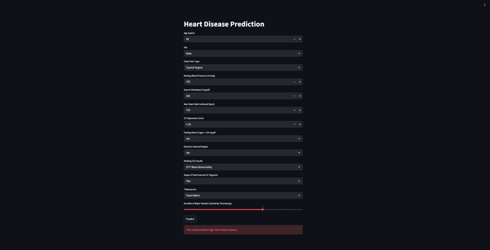
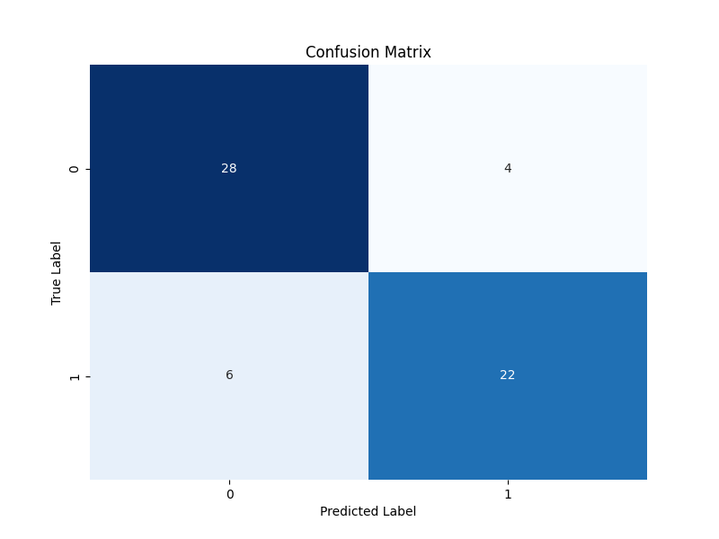

# Heart Disease Predictor

A machine learning pipeline to predict heart disease presence based on the UCI Cleveland dataset.

## Live Demo

Check out the live application here: [Heart Disease Predictor](https://heart-frontend-856s.onrender.com)

## Model Performance

The model was evaluated on a reserved test set (20% of data).

| Metric | Score | Description |
| :- | - | - |
| **Accuracy** | **83%** | Overall correctness of predictions. |
| **Recall (Class 1)** | **0.79** | The model correctly identifies 79% of positive heart disease cases. |
| **Precision (Class 1)** | **0.85** | When the model predicts disease, it is correct 85% of the time. |

### Confusion Matrix

The model successfully identified **22 out of 28** positive cases in the test batch.

## Project Structure

- `data/`: Contains raw and processed data (ignored by git).
- `notebooks/`: Jupyter notebooks for exploration and prototyping.
- `src/`: Production-ready Python scripts.
- `models/`: Serialized models (ignored by git).

## Tech Stack 🛠️

This project uses a decoupled architecture with a separate frontend and backend, containerized for portability.

- **Machine Learning**:
  - `scikit-learn`: Model training and evaluation.
  - `pandas` & `numpy`: Data manipulation and preprocessing.
  - `joblib`: Model serialization.
- **Backend API**:
  - `FastAPI`: High-performance web framework for serving predictions.
  - `Uvicorn`: ASGI server for production.
- **Frontend UI**:
  - `Streamlit`: Interactive web interface for users.
- **DevOps & Deployment**:
  - `Docker`: Containerization of services.
  - `Docker Compose`: Orchestration of multi-container environments.
  - `Render`: Cloud platform for deployment.

## Setup

1. Clone the repo.
2. Run the app on your local machine:
    - Install dependencies: `pip install -r requirements.txt`
    - Run the API: `uvicorn src.app:app --reload`
    - Access the Streamlit app: `streamlit run src/streamlit_app.py`
3. Alternatively, use Docker Compose to run both services: `docker-compose up`
    - Access the app at `http://localhost:8501`
    - Access the API at `http://localhost:8000`

## Dataset Description

The dataset used in this project is the UCI Cleveland Heart Disease dataset, which contains various medical attributes related to heart disease. The target variable indicates the presence or absence of heart disease.

Source: [UCI Machine Learning Repository](https://archive.ics.uci.edu/ml/machine-learning-databases/heart-disease/processed.cleveland.data)

Here's a brief description of the features:

| **Column** | **Full Name** | **Description** | **Key Values** |
| - | - | - | - |
| **`age`** | Age | Patient's age in years. | |
| **`sex`** | Sex | Biological sex of the patient. | `1` = Male `0` = Female |
| **`cp`** | **Chest Pain Type** | The type of chest pain experienced. | `1` = Typical Angina `2` = Atypical Angina `3` = Non-anginal Pain `4` = Asymptomatic |
| **`trestbps`** | Resting Blood Pressure | Blood pressure reading upon admission (mm Hg). | |
| **`chol`** | Cholesterol | Serum cholesterol in mg/dl. | |
| **`fbs`** | Fasting Blood Sugar | Whether fasting blood sugar > 120 mg/dl. | `1` = True `0` = False |
| **`restecg`** | Resting ECG | Resting electrocardiographic results. | `0` = Normal `1` = ST-T wave abnormality `2` = Left ventricular hypertrophy |
| **`thalach`** | Max Heart Rate | Maximum heart rate achieved during the test. | |
| **`exang`** | Exercise-Induced Angina | Chest pain caused by exercise? | `1` = Yes `0` = No |
| **`oldpeak`** | ST Depression | ST depression induced by exercise relative to rest (indicates heart stress). | |
| **`slope`** | **Slope** | The slope of the peak exercise ST segment. | `1` = Upsloping `2` = Flat `3` = Downsloping |
| **`ca`** | **Major Vessels** | Number of major vessels colored by fluoroscopy. | `0` to `3` |
| **`thal`** | **Thalassemia** | A blood disorder classification. | `3` = Normal `6` = Fixed Defect `7` = Reversable Defect |
| **`target`** | Diagnosis | Presence of heart disease. | `0` = No Disease `1` = Disease |
